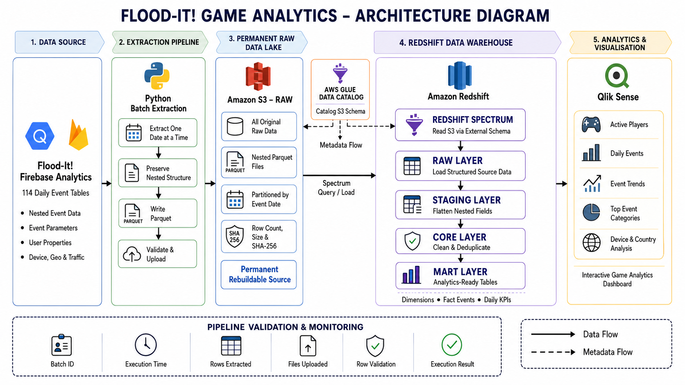
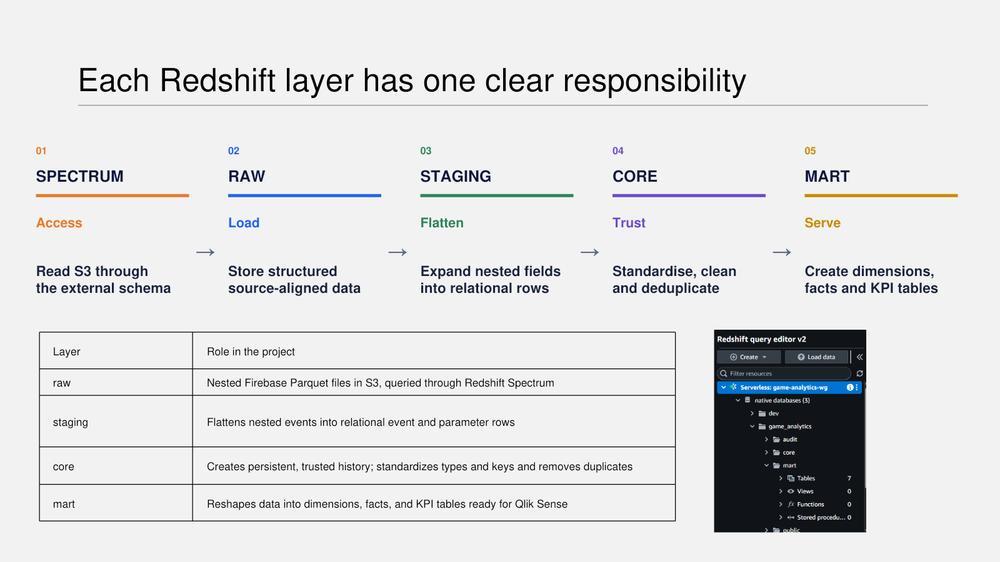
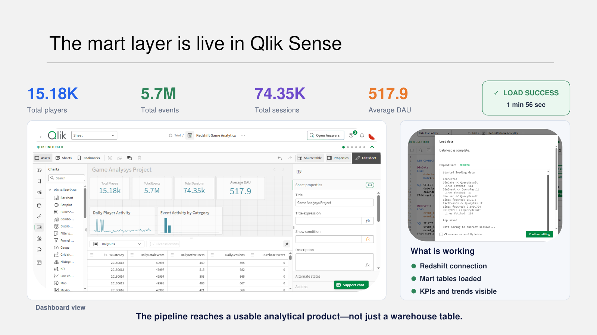

# Cross-Cloud Game Analytics

**An end-to-end data engineering and BI pipeline that transforms nested Firebase game events into analytics-ready Redshift marts and a Qlik Sense dashboard.**

<p align="left">
  
  
  
  
  
  
  
</p>

**Min Long (Lucy)**  
Data Analyst | Analytics Engineer | BI Developer  
[GitHub profile](https://github.com/lucy20080331-nz)

| Data coverage | Players | Events | Sessions |
|---:|---:|---:|---:|
| **114 days** | **15,175** | **5.7 million** | **74,353** |

## Architecture



```text
BigQuery / Firebase
        |
        v
Python batch extraction
        |
        v
Amazon S3 RAW - nested Parquet, partitioned by event_date
        |
        +----> AWS Glue Data Catalog
        |              |
        v              v
Redshift Spectrum external table
        |
        v
STAGING - flatten nested events, parameters and user properties
        |
        v
CORE - standardise, validate and deduplicate
        |
        v
MART - dimensions, fact events and aggregated KPIs
        |
        v
Qlik Sense dashboard
```

## Key Strengths

- **Real-world scale** - 114 days of game activity with 5.7M nested events.
- **Cross-cloud integration** - connects Google BigQuery, Python, AWS S3, Glue, Redshift and Qlik Sense.
- **Rebuildable RAW layer** - preserves the original nested Parquet files in low-cost S3 storage.
- **Safe batch recovery** - processes one date at a time and skips previously validated files.
- **Data quality controls** - validates row counts, file size, schema and SHA-256 metadata.
- **Layered modelling** - separates flattening, cleaning, deduplication and reporting logic.
- **Cost-conscious design** - uses BigQuery Sandbox, S3 RAW storage, Spectrum and Redshift Serverless.

## Technology Stack

| Layer | Technology | Purpose |
|---|---|---|
| Source | Google BigQuery / Firebase Analytics | Public Flood-It mobile-game event data |
| Extraction | Python, BigQuery Storage API, PyArrow | Daily extraction while preserving nested fields |
| Data lake | Amazon S3, Parquet | Permanent RAW storage partitioned by event date |
| Metadata | AWS Glue Data Catalog | Registers the external schema and S3 metadata |
| Warehouse access | Redshift Spectrum | Queries nested Parquet through an external table |
| Transformation | Amazon Redshift Serverless, SQL | STAGING, CORE and MART modelling |
| Analytics | Qlik Sense | KPI, trend and gameplay reporting |
| Configuration | dotenv, gcloud ADC, AWS credential chain | Secure local and cloud configuration |

## Project Overview

This project uses the public Google Firebase Analytics dataset for the **Flood-It!** mobile game:

- Dataset: `firebase-public-project.analytics_153293282`
- Tables: `events_20180612` to `events_20181003`
- Coverage: 114 daily tables
- Format: nested Firebase / GA4 event records
- Main data areas: events, event parameters, user properties, device, geography, app information, traffic source and gameplay activity

The source is a useful data-engineering challenge because it combines:

- nested arrays and structures;
- complex level states such as start, complete, fail, retry and reset;
- missing and duplicated records;
- multiple cloud and BI platforms.

## Key Outcomes

- Successfully connected the complete **BigQuery -> S3 -> Glue -> Redshift -> Qlik** workflow.
- Preserved all source data in a permanent, partitioned and rebuildable S3 RAW layer.
- Created a Medallion-style **STAGING -> CORE -> MART** transformation pipeline.
- Flattened Firebase event parameters and user properties into relational Redshift tables.
- Removed **206 duplicate event rows**, producing **5,699,794 trusted events**.
- Created dimensions, a detailed event fact table and dashboard-ready aggregates.
- Loaded the final marts into Qlik Sense and produced a working game analytics dashboard.

## Redshift Data Layers

| Layer | Main objects | Responsibility |
|---|---|---|
| RAW access | `spectrum_raw.firebase_events` | Exposes nested S3 Parquet through Redshift Spectrum |
| STAGING | `stg_events`, `stg_event_params`, `stg_user_properties` | Flattens source structures while preserving duplicates |
| CORE | `events`, `event_params`, `user_properties` | Creates trusted, standardised and deduplicated history |
| MART | Dimensions, `fact_events`, `daily_kpis`, `gameplay_performance` | Publishes analytics-ready data for Qlik Sense |



## Data Quality Results

| Validation | Result |
|---|---:|
| Source dates loaded | 114 |
| STAGING event rows | 5,700,000 |
| Distinct event IDs | 5,699,794 |
| Duplicate rows identified and removed | 206 |
| Remaining CORE event duplicates | 0 |
| Unique players | 15,175 |
| First event date | 2018-06-12 |
| Last event date | 2018-10-03 |

The SQL files also validate parameter values, property values, orphan records, dimension relationships and mart-to-source reconciliation.

## Analytics Model

### Dimensions

- `mart.dim_date`
- `mart.dim_event`
- `mart.dim_user`
- `mart.dim_game_content`

### Facts and aggregates

- `mart.fact_events` - one row per trusted Firebase event
- `mart.daily_kpis` - one row per calendar date
- `mart.gameplay_performance` - one row per progressive level or Quickplay board

The marts support player activity, sessions, engagement, event trends, gameplay outcomes, scores, extra steps, ad rewards and purchase activity.

## Qlik Sense Result

The completed V1 pipeline loads the Redshift MART layer into Qlik Sense and exposes:

- total and daily active players;
- total events and sessions;
- daily player activity;
- event activity by category;
- gameplay performance by level or board;
- device and geographic analysis.



## Repository Structure

```text
Cross-Cloud-Game-Analytics-v1/
|
|-- docs/
|   |-- architecture.png
|   |-- qlik-dashboard.png
|   `-- redshift-medallion.png
|
|-- src/
|   `-- extract_bigquery_to_s3_raw.py
|
|-- sql/
|   |-- 00_create_internal_schemas.sql
|   |-- 01_create_spectrum_raw_firebase_events.sql
|   |-- 02_create_staging_tables.sql
|   |-- 03_create_core_tables.sql
|   `-- mart/
|       |-- 00_run_order.sql
|       |-- 01_dimensions.sql
|       |-- 02_fact_events.sql
|       |-- 03_daily_kpis.sql
|       `-- 04_gameplay_performance.sql
|
|-- .env.example
|-- .gitignore
|-- requirements.txt
`-- README.md
```

## Setup

### 1. Clone the repository

```bash
git clone https://github.com/<your-username>/cross-cloud-game-analytics.git
cd cross-cloud-game-analytics
```

### 2. Create a Python environment

Python 3.12 was used for V1.

```bash
python -m venv .venv
```

Activate it and install the dependencies:

```bash
pip install -r requirements.txt
```

### 3. Configure the project

Copy `.env.example` to `.env` and provide your own project and bucket names:

```env
GOOGLE_CLOUD_PROJECT=your-gcp-project-id
GAME_ANALYTICS_S3_BUCKET=your-game-analytics-bucket
GAME_ANALYTICS_SOURCE_DATASET=firebase-public-project.analytics_153293282
GAME_ANALYTICS_S3_PREFIX=raw/firebase/events
AWS_REGION=us-east-1
```

Cloud credentials are deliberately excluded from the repository.

Authenticate using the standard credential stores:

```bash
gcloud auth application-default login
aws configure
```

### 4. Extract BigQuery data to S3

Test one daily table:

```bash
python src/extract_bigquery_to_s3_raw.py --table events_20180612
```

Process all 114 tables:

```bash
python src/extract_bigquery_to_s3_raw.py --all-tables
```

Each file is uploaded to:

```text
s3://<bucket>/raw/firebase/events/event_date=YYYY-MM-DD/events_YYYYMMDD.parquet
```

### 5. Configure AWS Glue and Redshift Spectrum

Create the following cloud resources before running the SQL:

- an S3 bucket for RAW Parquet;
- an AWS Glue Data Catalog database;
- a Redshift Serverless namespace and workgroup;
- a Redshift IAM role with S3 and Glue access;
- the `spectrum_raw` external schema.

In `sql/01_create_spectrum_raw_firebase_events.sql`, replace:

```text
your-game-analytics-bucket
```

with the bucket configured in `.env`.

### 6. Run the Redshift SQL

Run the files in this order:

```text
sql/00_create_internal_schemas.sql
sql/01_create_spectrum_raw_firebase_events.sql
sql/02_create_staging_tables.sql
sql/03_create_core_tables.sql
sql/mart/01_dimensions.sql
sql/mart/02_fact_events.sql
sql/mart/03_daily_kpis.sql
sql/mart/04_gameplay_performance.sql
sql/mart/00_run_order.sql
```

The final file provides the mart inventory and reconciliation checks.

### 7. Connect Qlik Sense

Create a Redshift connection in Qlik Sense and load the MART objects required by the dashboard. The V1 demo uses `mart.daily_kpis`, `mart.fact_events` and `mart.gameplay_performance`.

## Cost Management

- **BigQuery Sandbox** provides a free monthly query allowance for exploration.
- **One-date-at-a-time extraction** limits reprocessing and makes failures recoverable.
- **S3** stores the complete RAW history at low cost.
- **Stable object keys** allow valid dates to be skipped safely.
- **Redshift Spectrum** reads external Parquet without duplicating the entire RAW layer.
- **Redshift Serverless** supports a time-boxed portfolio workload without a permanent cluster.

## V1 Status

**Version 1 is complete.** It proves the full data path from public nested game events to a working Qlik Sense analytical product.

Completed:

- BigQuery extraction;
- validated S3 RAW storage;
- Glue and Spectrum access;
- STAGING, CORE and MART transformations;
- data quality and reconciliation checks;
- Redshift-to-Qlik connection;
- baseline Qlik dashboard.

Possible future enhancements:

- incremental daily orchestration;
- infrastructure as code;
- automated SQL tests and CI/CD;
- retention and cohort marts;
- deeper gameplay and live-operations analysis.

## Data and Security Notes

- Raw data is not committed to this repository.
- The source dataset is public, anonymised Firebase demo data provided through Google BigQuery.
- AWS and Google credentials must remain outside Git and use their standard credential stores.
- S3 bucket names and cloud project identifiers in this repository are examples only.
